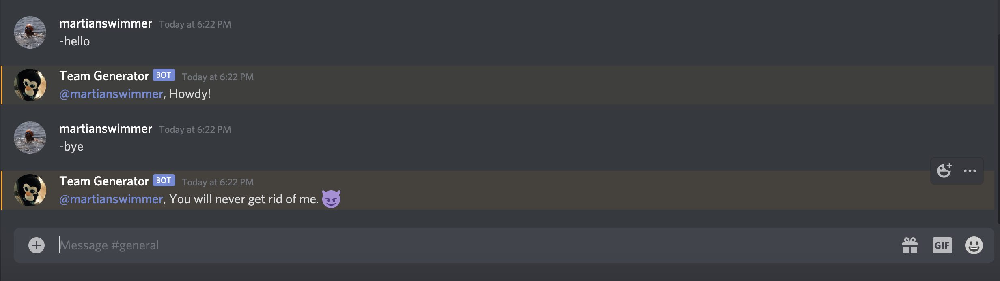
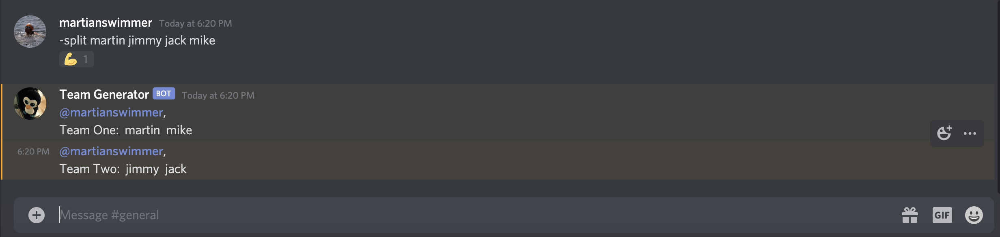
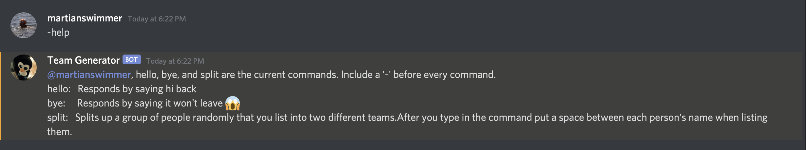

# Team-Generator-Bot
## Discord Bot that splits a list of people into two different teams. Applicable to anything such as board games, sports like basketball, volleyball, and etc...

**Invite Team-Generator-Bot to your Discord Server!
https://discord.com/api/oauth2/authorize?client_id=732314129825661088&scope=bot&permissions=1

**Commands**:

-hello: Prompts bot to greet user

-bye: Prompts bot to reply with You will never get rid of me. 😈

-split: Prompts bot to divide list of names into two different teams. When using split command, user must put a space between each name for bot to recognize them as separate.

-reshuffle: Prompts bot to remakes teams if the previous teams made were not satsifactory to the user.

-help: Prompts bot to give a list of current commands 

